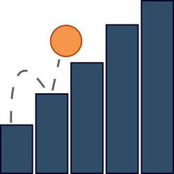

<p align="center">
  
</p>

<h1 align="center">GameStats</h1>

<p align="center">GameStats binds to your game loop and provides helpful statistics about your game's performance.<p>

<div align="center">

  [](https://www.npmjs.com/package/game-stats)
  [](https://snyk.io/test/github/robertcorponoi/game-stats)
  
  [](https://www.npmjs.com/package/game-stats)
  <a href="https://badge.fury.io/js/game-stats"></a>
  <a href="https://badge.fury.io/js/game-stats"></a>
  [](https://gitter.im/robertcorponoi)

</div>

## **Installation**

To install this module through npm, simply use:

```
$ npm install game-stats
```

and to use it, you can import it as an ES6 module:

```js
// Webpack
import GameStats from 'game-stats';

// Browser
import GameStats from './node_modules/game-stats/game-stats.js';
```

## **Initialization**

After installing GameStats, it can be initialized like so:

```js
const gameStats = new GameStats();
```

GameStats also accepts an options object at initialization with the following options available:

| param              | type    | description                                                                                                                              | default  |
|--------------------|---------|------------------------------------------------------------------------------------------------------------------------------------------|----------|
| historyLimit       | number  | The amount of items that will be kept in history to be used in calculations. The more history you keep the more accurate the calculations but the longer they will take.  | 10        |

So an example of initializating game-stats with options is:

```js
const options = {
  historyLimit: 15
};

const gameStats = new GameStats(options);
```

## **Usage**

GameStats works with your requestAnimationFrame loop to give you more detailed data about the performance of your game. For example, a typical game loop using requestAnimationFrame would look like this:

```js
const canvas = document.getElementById('myCanvas');
const ctx = canvas.getContext('2d');

let x = canvas.width / 2;
let y = canvas.height - 30;

function drawCircle() {
  ctx.beginPath();
  ctx.arc(x, y - 30, 10, 0, Math.PI * 2);
  ctx.fillStyle = '#0095DD';
  ctx.fill();
  ctx.closePath();
}

function draw(time) {
  ctx.clearRect(0, 0, canvas.width, canvas.height);
  
  drawCircle();

  x += 2;
  y += -2;

  requestAnimationFrame(draw);
}

requestAnimationFrame(draw);
```

To start gathering data about this game loop, you simply call GameStat's record method after the call to requestAnimationFrame like so:

```js
const canvas = document.getElementById('myCanvas');
const ctx = canvas.getContext('2d');

let x = canvas.width / 2;
let y = canvas.height - 30;

function drawCircle() {
  ctx.beginPath();
  ctx.arc(x, y - 30, 10, 0, Math.PI * 2);
  ctx.fillStyle = '#0095DD';
  ctx.fill();
  ctx.closePath();
}

// Timestamp parameter automatically passed by requestAnimationFrame.
function draw(timestamp) {
  ctx.clearRect(0, 0, canvas.width, canvas.height);
  
  drawCircle();

  x += 2;
  y += -2;

  requestAnimationFrame(draw);

  // Record statistics here, notice the timestamp parameter passed to record.
  gameStats.record(timestamp);
}

// Timestamp is passed to draw automatically without us having to do anything.
requestAnimationFrame(draw);
```

You'll notice that record takes a parameter, timestamp, which matches the parameter taken by the draw function. If this is new to you, it's a parameter passed by requestAnimationFrame to any function you give it and GameStats uses it to gather information so it must be provided as a parameter to record.

## **API**

After you start recording, the following methods are available:

### **stats**

Gets all of the statistics about the game loop at the current point in time.

The object returned by this method contains the following data:

| param                  	|         type        	|                                                                                                                                 description 	|
|------------------------	|-------------------	|--------------------------------------------------------------------------------------------------------------------------------------------	|
| browser                	| Object              	| Information about the browser being used to run the game loop.                                                                              	|
| browser.<span></span>name           	| string              	| The name of the browser being used.                                                                                                         	|
| browser.version        	| string              	| The version of the browser being used.                                                                                                      	|
| timestamp              	| DOMHighResTimeStamp 	| The current timestamp of the game loop.                                                                                                     	|
| prevTimestamp          	| DOMHighResTimeStamp 	| The previous timestamp of the game loop.                                                                                                    	|
| predictedNextTimestamp 	| number              	| The predicted next timestamp of the game loop. Note: This is predicted from the average of previous timestamps but is in no way dependable. 	|
| delta                  	| number              	| The time in between the previous and current timestamp.                                                                                     	|
| deltaAverage           	| number              	| The average time in between previous and current timestamps. This uses a collection of deltas to compute the average.                       	|
| frame                  	| number              	| The current frame that the game is on.                                                                                                      	|
| fps                    	| number              	| The number of frames per second that the game is running at.                                                                                	|
| fpsAverage             	| number              	| The average number of frames per second that the game is running at. This uses a collection of fps values to compute the average.           	|
| history                	| Object              	| A collection of the histories of certain statistics.                                                                                        	|
| history.timestamps     	| Array               	| The history of timestamps.                                                                                                                  	|
| history.deltas         	| Array               	| The history of delta values.                                                                                                                	|                                                                                                        	|

```js
const stats = gameStats.stats();

console.log(stats.fps); // 60, hopefully.
```

## **Tests**

The tests for game-stats are browser based so to run them you will first need to start the local testing server like so:

```bash
$ npm run test
```

then you will need to navigate to https://localhost/test/index.html in your browser to run all of the available tests for game-stats.

## **License**

MIT